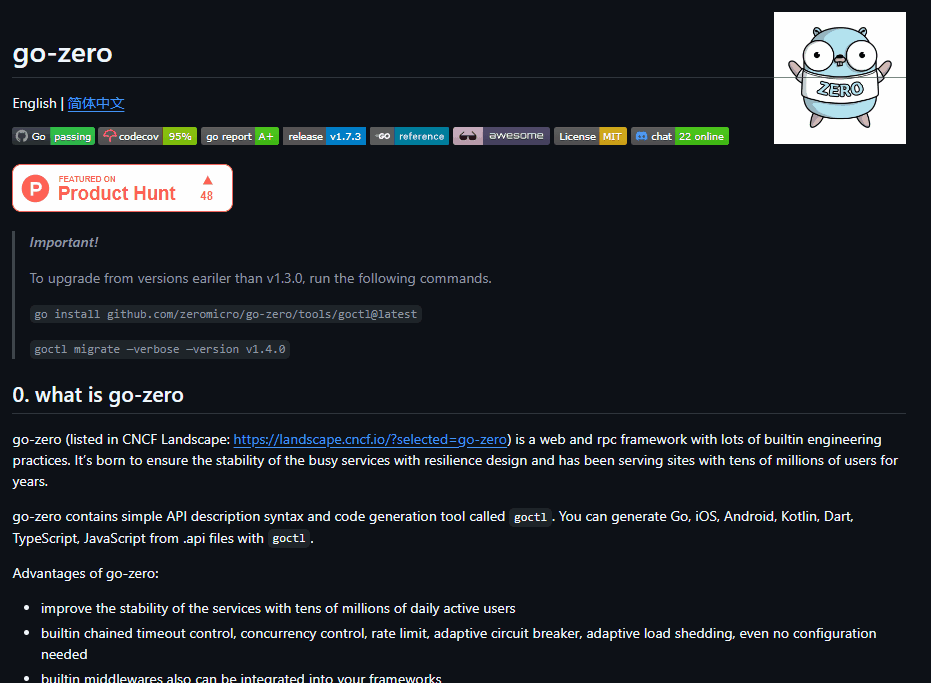

# teste projeto README
um projeto de teste com um arquivo README 💎

[]

## Tecnologia ultilizada
- HTML
- CSS
- JS

## Como utilizar 
(colacar como ultilazer meu projeto)

 1- Clone pro projeto 
````
 git clone <url>
 ````
 1- Acessar a pasta do projeto
 ````
 cd respositorio-com-readme
